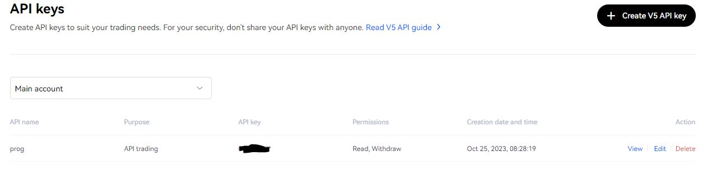
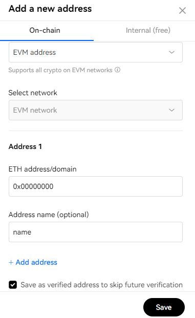
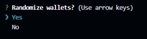
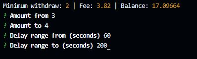
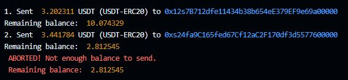

> [!IMPORTANT]
> This script does not store or send any information. All your private data is stored only on your computer. Please keep your api token data in a safe place, because an attacker can steal all your funds if he takes possession of it !!!

## Usage

### Previous preparation

1. Install [node.js](https://nodejs.org/en/download)
2. Create [okx api](https://www.okx.com/ua/account/my-api) and save your `apikey`, `secretKey` and `password` in a safe place.

 

3. Add crypto addresses which you want to use in script to Whitelist and mark up "Save as verified address to skip future verification"

 

### Script usage

1. Clone or download this repo.
2. Add addresses from Whitelist to `wallets.txt`
3. Insert your `apikey`, `secretKey` and `password` in `privateKeys.mjs`
4. Run `npm install` in tokenSender directory
5. Run `npm start`

### Functional

1. Send tokens to wallets in a random order?

 

2. Choose token and chain
3. Set range from/to token amount in order to randomize each withdrawal
4. Set range from/to delay to randomize the delay between each operation

 

5. If you run out of funds while the script is running, it will notify you and terminate the work

 

